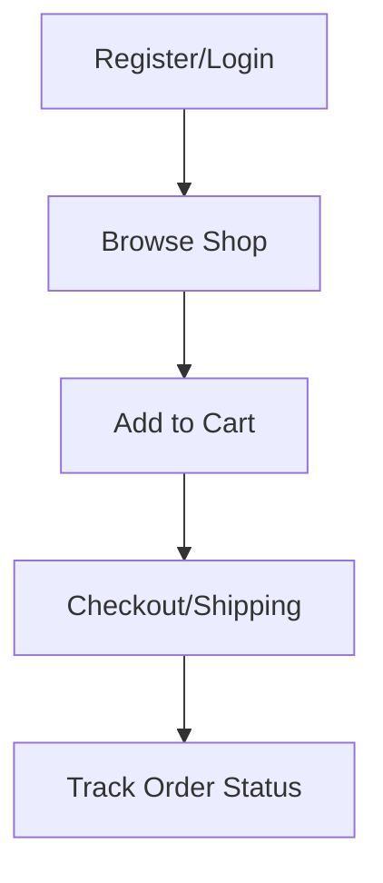
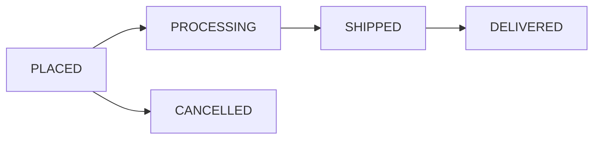

# MedQuix 💊
**"Your Trusted Online Medicine Shop"**

🔗 **Links:**
- **Live Site:** [medquix-client.vercel.app](https://medquix-client.vercel.app/)
- **Backend Repository:** [Medquix-server](https://github.com/iktushar01/Medquix-server.git)

---

## Project Overview

MedQuix is a full-stack e-commerce web application for purchasing over-the-counter (OTC) medicines. Customers can browse medicines, add to cart, and place orders. Sellers manage their medicine inventory and fulfill orders. Admins oversee the platform and manage all users and listings.

---

## Roles & Permissions

| Role | Description | Key Permissions |
|------|-------------|-----------------|
| **Customer** | Users who purchase medicines | Browse, cart, order, track status, leave reviews |
| **Seller** | Medicine vendors/pharmacies | Manage inventory, view orders, update order status |
| **Admin** | Platform moderators | Manage all inventory, users, oversee orders |

> [!NOTE]
> Users select their role during registration. Admin accounts should be seeded in the database.

---

## Tech Stack

🛠️ **Core Technologies:**

- **Framework:** [Next.js 16 (Canary)](https://nextjs.org/)
- **Library:** [React 19](https://react.dev/)
- **Styling:** [Tailwind CSS 4](https://tailwindcss.com/)
- **Authentication:** [Better-Auth](https://www.better-auth.com/)
- **Data Fetching:** [TanStack Query v5](https://tanstack.com/query/latest)
- **Icons:** [Lucide React](https://lucide.dev/)
- **UI Components:** [Radix UI](https://www.radix-ui.com/) & [Shadcn/UI](https://ui.shadcn.com/)
- **Form Handling:** [React Hook Form](https://react-hook-form.com/) & [Zod](https://zod.dev/)
- **Charts:** [Recharts](https://recharts.org/)
- **Notifications:** [Sonner](https://sonner.stevenly.me/) & [SweetAlert2](https://sweetalert2.github.io/)

---

## Features

### Public Features
- Browse all available medicines
- Search and filter by category, price, manufacturer
- View medicine details

### Customer Features
- Register and login as customer
- Add medicines to cart
- Place orders with shipping address (Cash on Delivery)
- Track order status
- Leave reviews after ordering
- Manage profile

### Seller Features
- Register and login as seller
- Add, edit, and remove medicines
- Manage stock levels
- View incoming orders
- Update order status

### Admin Features
- View all users (customers and sellers)
- Manage user status (ban/unban)
- View all medicines and orders
- Manage categories

---

## Pages & Routes

### Public Routes
| Route | Page | Description |
|-------|------|-------------|
| `/` | Home | Hero, categories, featured |
| `/shop` | Shop | All medicines with filters |
| `/shop/:id` | Medicine Details | Info, add to cart |
| `/login` | Login | Login form |
| `/register` | Register | Registration form |

### Customer Routes (Private)
| Route | Page | Description |
|-------|------|-------------|
| `/cart` | Cart | View cart items |
| `/checkout` | Checkout | Shipping address |
| `/orders` | My Orders | Order history |
| `/orders/:id` | Order Details | Items, status |
| `/profile` | Profile | Edit info |

### Seller Routes (Private)
| Route | Page | Description |
|-------|------|-------------|
| `/seller/dashboard` | Dashboard | Orders, stats |
| `/seller/medicines` | Inventory | Manage medicines |
| `/seller/orders` | Orders | Update status |

### Admin Routes (Private)
| Route | Page | Description |
|-------|------|-------------|
| `/admin` | Dashboard | Statistics |
| `/admin/users` | Users | Manage users |
| `/admin/orders` | Orders | All orders |
| `/admin/categories` | Categories | Manage categories |

---

## Database Schema

Core tables designed for the platform:

- **Users**: Authentication, profile info, and role.
- **Categories**: Taxonomies for medicine classification.
- **Medicines**: Product details linked to specific sellers.
- **Orders**: Transaction records including items, totals, and status.
- **Reviews**: Customer feedback and ratings for medicines.

---

## API Endpoints (Core)

### Authentication
- `POST /api/auth/register` - Register new user
- `POST /api/auth/login` - Login user
- `GET /api/auth/me` - Get current user

### Medicines & Orders
- `GET /api/medicines` - Get all medicines with filters
- `POST /api/orders` - Create new order
- `GET /api/orders` - Get user's orders

### Management
- `POST /api/seller/medicines` - Add/Update inventory
- `PATCH /api/seller/orders/:id` - Update status
- `PATCH /api/admin/users/:id` - Manage user status

---

## Flow Diagrams

### 💊 Customer Journey

### 📊 Order Status Lifecycle

